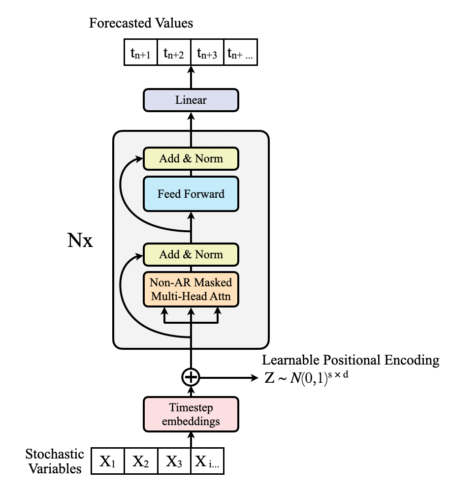
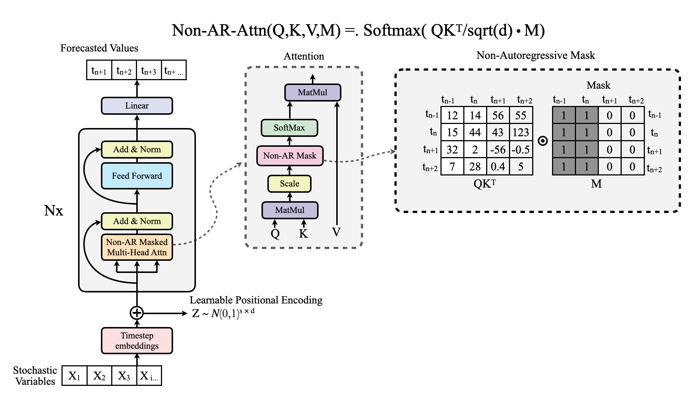

# Temporal Sequence Transformer (TST)

**Non-Autoregressive Time-Series Forecasting and Classification**

[](https://pytorch.org/)
[](https://opensource.org/licenses/MIT)

## Introduction

The **Temporal Sequence Transformer (TST)** is a non-autoregressive transformer-based architecture designed for efficient time-series forecasting and classification. It leverages a custom attention mechanism, positional encodings (learnable or sinusoidal), and a decoder-only structure to model long-range dependencies in time-series data. This repository implements two models:

- **Non_AR_TST**: For long-term time-series forecasting.
- **Non_AR_TSCT**: For time-series classification (work in progress)

The TST is designed for applications like financial forecasting, traffic analysis, and energy consumption prediction, offering flexibility for both univariate and multivariate datasets.

## Model Overview

The Temporal Sequence Transformer introduces a non-autoregressive approach to time-series tasks, avoiding iterative decoding for faster inference. Key components include:

- **Projection Layer**: Maps timesteps of features to a higher-dimensional embedding space.
- **Positional Encoding**: Sinusoidal or learnable encodings for temporal context.
- **Non-AR Masked Multi-Head Attention**: Captures dependencies across time steps efficiently.
- **Decoder Stack**: Processes input sequences with masked attention for forecasting/classification.
- **Non-Autoregressive Output**: Predicts entire future sequences or class probabilities in one pass.

## TST architecture:



## Non-AR Masked Multi-Head Attention:



## Citation

If you use this code in your research, please cite our work:

```bibtex
@article{tst2025,
  title={Temporal Sequence Transformer: Non-Autoregressive Time-Series Forecasting and Classification},
  author={Nimbalkar, Paartha},
  journal={TBD},
  year={2025}
}
